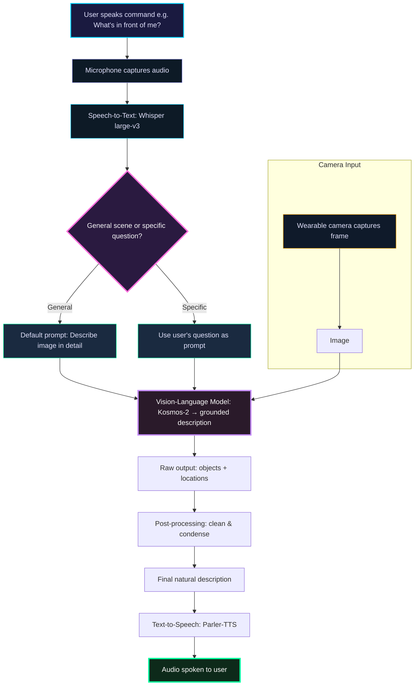
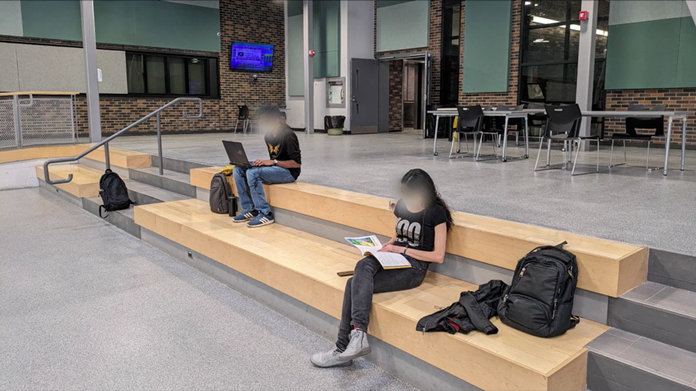
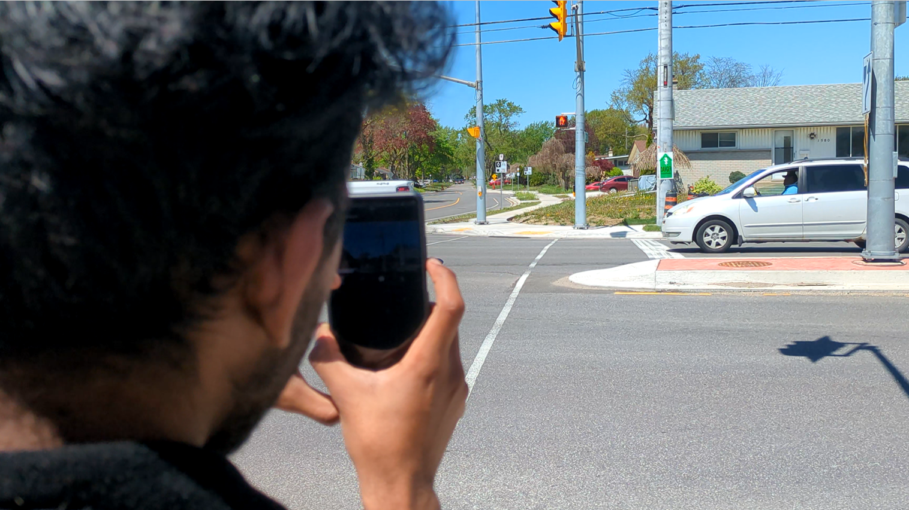
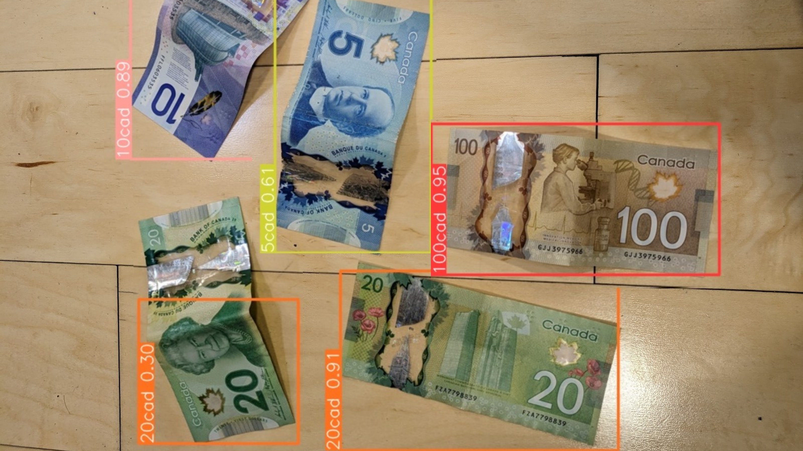

# RIVA: Real-time Intelligent Vision Assistant 

**RIVA** is an innovative AI-powered assistant designed to empower individuals with visual impairments by providing real-time audio descriptions of their surroundings. Originally conceptualized for the <a href=https://www.stclaircollege.ca/ford-innovation-showcase/2024-gallery target="_blank">**Ford Innovation Showcase 2024**</a>, RIVA secured a **Top 10** position, highlighting the power of accessible AI technology.

The system uses a proposed wearable camera (envisioned as a locket-style device) to capture the environment continuously. Through a chain of open-source AI models, it transcribes user voice commands, interprets visual scenes, refines descriptions, and speaks helpful information back to the user — all in near real-time.

## Features

- Voice-activated interaction (ask questions like "What's in front of me?" or "Describe the room")
- Real-time scene understanding and detailed audio descriptions
- Object detection, spatial grounding, and natural language scene narration
- Fully built with **open-source** pre-trained models from Hugging Face
- Modular pipeline — easy to swap or upgrade individual components
- Designed with accessibility and independence in mind

## Achievement

Top 10 finalist in the <a href=https://www.stclaircollege.ca/ford-innovation-showcase/2024-gallery target="_blank">**Ford Innovation Showcase 2024**</a> — celebrating transformative AI for accessibility.

## How It Works

RIVA processes input in a sequential multimodal pipeline:

## Model Results & Demonstrations

Here are real-world examples of how **RIVA** performs in practical scenarios. The system listens to voice commands, processes the visual input using Kosmos-2 for grounded understanding, refines the description, and speaks back clearly and helpfully.

### 1. General Environment Description
**User prompt:** "Hey RIVA! Describe the environment."

This shows RIVA providing a natural, detailed spoken description of the surroundings (e.g., room layout, objects, people, etc.).

**RIVA's spoken output (transcribed):**  
"The environment features a large open space with two students sitting on the steps of a staircase. One student is sitting on the left side of the stairs, while the other is on the right side. They are both working, with one student holding a book and the other holding a laptop. There are multiple chairs scattered around the space, with some placed near the stairs and others further away. In the background, there is a TV mounted on the wall, on the far left side."

**Full video demo:**
videos/Video 1.mp4

### 2. Safety-Critical Query: Road Crossing Assistance
**User prompt:** "Hey RIVA! Can I cross the road now?"

This demonstrates RIVA's ability to interpret safety-related questions, detect relevant elements (vehicles, traffic lights, pedestrians, road conditions), and give a cautious, actionable spoken response.

**RIVA's spoken output (transcribed):**  
"No, the traffic light is red, which means you should wait for now. Do you want me to tell you once it becomes green?"

**Full video demo:**
videos/Video 2.mp4

### 3. Object Detection on Canadian Banknotes
RIVA can also identify and describe specific objects like Canadian currency — useful for tasks such as shopping assistance, bill verification, or finding dropped money.

Below is an example of object detection results (bounding boxes + labels) on various Canadian notes ($5, $10, $20, etc.):

These demos highlight RIVA's multimodal capabilities: combining speech understanding, real-time vision, and natural audio feedback to support independence for people with visual impairments.